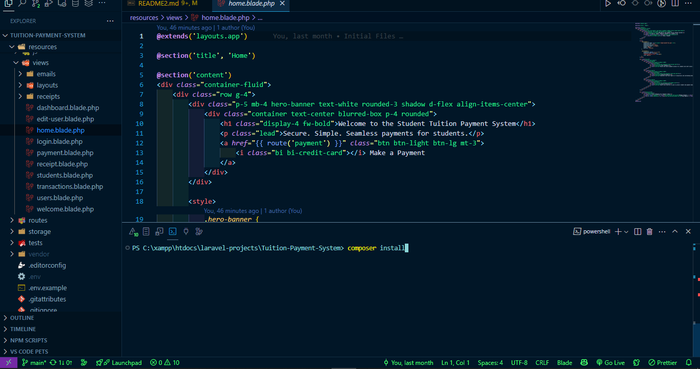
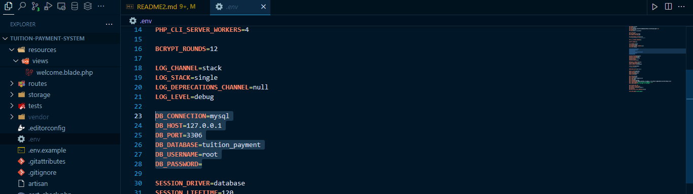
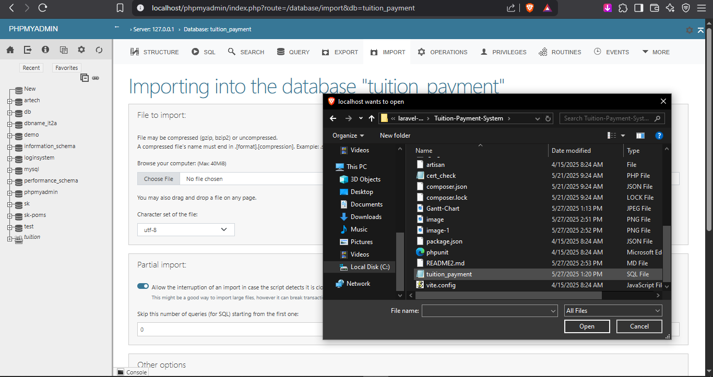
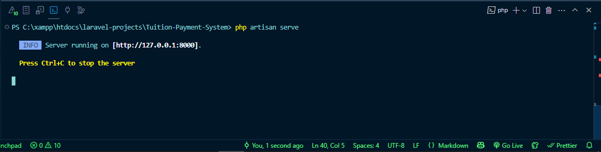

# Barcode-Based Student Tuition Payment System
REPOSITORY LINK -> https://github.com/Deoo0/barcode-tuition-payment-system.git

1. Install XAMPP and Composer
    1. Install Required Tools
    ✅ A. XAMPP
    Download and install it from:
    👉 https://www.apachefriends.org/index.html
    ✅ B. Composer
    Download and install from:
    👉 https://getcomposer.org/Composer-Setup.exe

During install, make sure Apache, MySQL, and phpMyAdmin are selected.

2. Copy the project folder to `C:\xampp\htdocs\`

3. Run `composer install` in the project folder:
    A. Open Project in VS CODE, (Ctrl + J) to open terminal
    Go to the project folder:
    cd C:\xampp\htdocs\tuition-payment-system
    Then install dependencies:
    composer install
    

4. Create a `.env` file and configure your database

    DB_CONNECTION=mysql
    DB_HOST=127.0.0.1
    DB_PORT=3306
    DB_DATABASE=tuition_payment
    DB_USERNAME=root
    DB_PASSWORD=

    

5. Import the SQL file via phpMyAdmin
    
6. Run `php artisan key:generate`
7. Run `php artisan migrate` (if needed)
8. Start the server with `php artisan serve`
    
